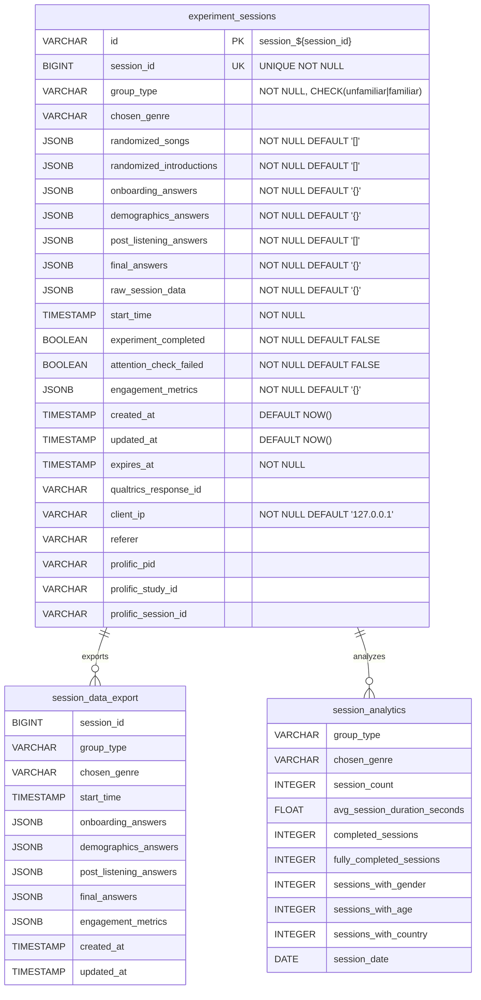
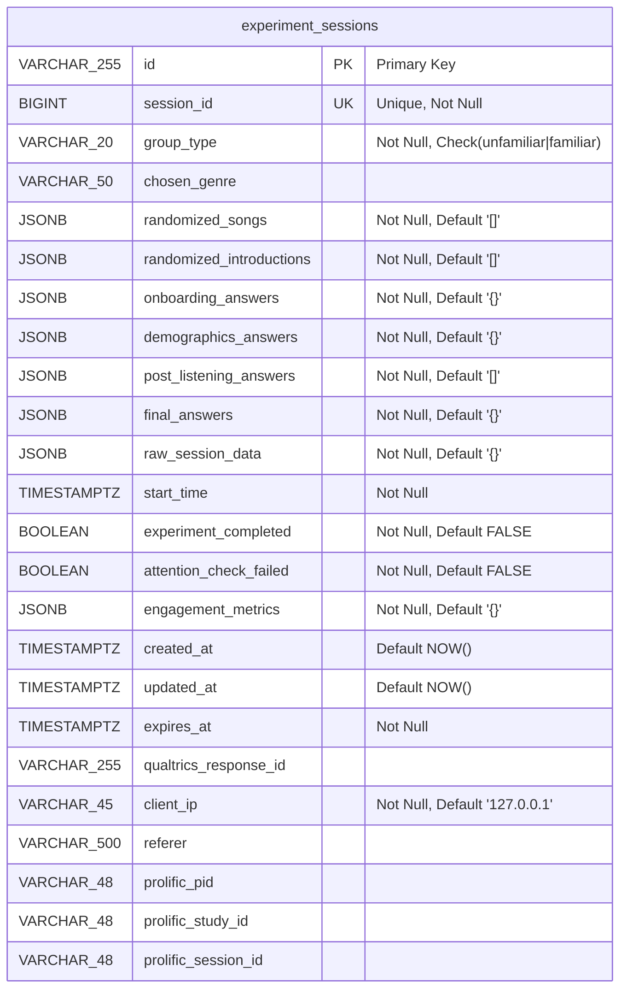
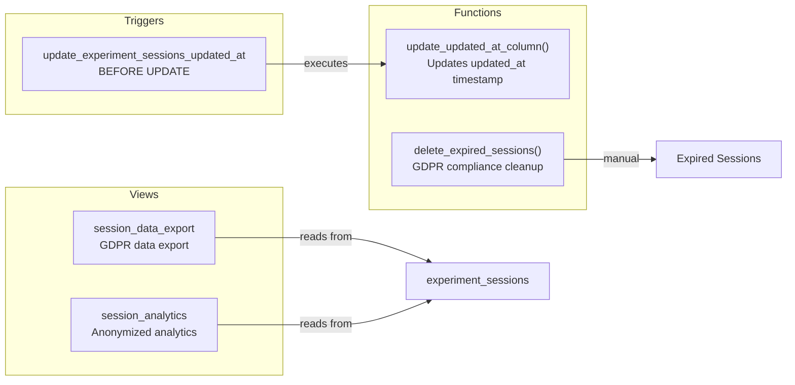
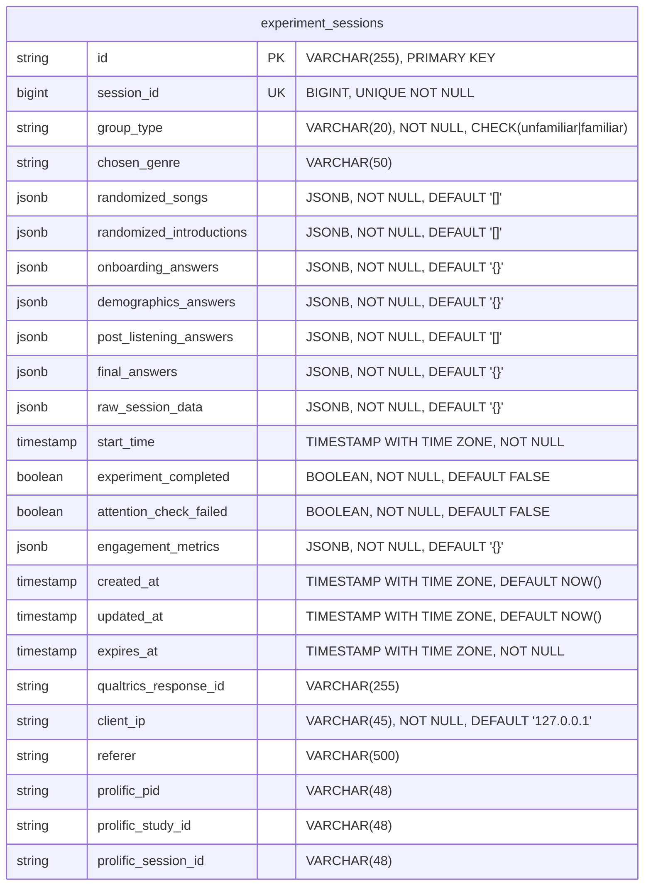

# Database Schema Visualization

## Entity Relationship Diagram

```mermaid
erDiagram
    experiment_sessions {
        VARCHAR id PK "session_${session_id}"
        BIGINT session_id UK "UNIQUE NOT NULL"
        VARCHAR group_type "NOT NULL, CHECK(unfamiliar|familiar)"
        VARCHAR chosen_genre
        JSONB randomized_songs "NOT NULL DEFAULT '[]'"
        JSONB randomized_introductions "NOT NULL DEFAULT '[]'"
        JSONB onboarding_answers "NOT NULL DEFAULT '{}'"
        JSONB demographics_answers "NOT NULL DEFAULT '{}'"
        JSONB post_listening_answers "NOT NULL DEFAULT '[]'"
        JSONB final_answers "NOT NULL DEFAULT '{}'"
        JSONB raw_session_data "NOT NULL DEFAULT '{}'"
        TIMESTAMP start_time "NOT NULL"
        BOOLEAN experiment_completed "NOT NULL DEFAULT FALSE"
        BOOLEAN attention_check_failed "NOT NULL DEFAULT FALSE"
        JSONB engagement_metrics "NOT NULL DEFAULT '{}'"
        TIMESTAMP created_at "DEFAULT NOW()"
        TIMESTAMP updated_at "DEFAULT NOW()"
        TIMESTAMP expires_at "NOT NULL"
        VARCHAR qualtrics_response_id
        VARCHAR client_ip "NOT NULL DEFAULT '127.0.0.1'"
        VARCHAR referer
        VARCHAR prolific_pid
        VARCHAR prolific_study_id
        VARCHAR prolific_session_id
    }

    session_data_export {
        BIGINT session_id
        VARCHAR group_type
        VARCHAR chosen_genre
        TIMESTAMP start_time
        JSONB onboarding_answers
        JSONB demographics_answers
        JSONB post_listening_answers
        JSONB final_answers
        JSONB engagement_metrics
        TIMESTAMP created_at
        TIMESTAMP updated_at
    }

    session_analytics {
        VARCHAR group_type
        VARCHAR chosen_genre
        INTEGER session_count
        FLOAT avg_session_duration_seconds
        INTEGER completed_sessions
        INTEGER fully_completed_sessions
        INTEGER sessions_with_gender
        INTEGER sessions_with_age
        INTEGER sessions_with_country
        DATE session_date
    }

    experiment_sessions ||--o{ session_data_export : "exports"
    experiment_sessions ||--o{ session_analytics : "analyzes"
```

## Detailed Schema Diagram

```mermaid
erDiagram
    experiment_sessions {
        VARCHAR_255 id PK "Primary Key"
        BIGINT session_id UK "Unique, Not Null"
        VARCHAR_20 group_type "Not Null, Check(unfamiliar|familiar)"
        VARCHAR_50 chosen_genre
        JSONB randomized_songs "Not Null, Default '[]'"
        JSONB randomized_introductions "Not Null, Default '[]'"
        JSONB onboarding_answers "Not Null, Default '{}'"
        JSONB demographics_answers "Not Null, Default '{}'"
        JSONB post_listening_answers "Not Null, Default '[]'"
        JSONB final_answers "Not Null, Default '{}'"
        JSONB raw_session_data "Not Null, Default '{}'"
        TIMESTAMPTZ start_time "Not Null"
        BOOLEAN experiment_completed "Not Null, Default FALSE"
        BOOLEAN attention_check_failed "Not Null, Default FALSE"
        JSONB engagement_metrics "Not Null, Default '{}'"
        TIMESTAMPTZ created_at "Default NOW()"
        TIMESTAMPTZ updated_at "Default NOW()"
        TIMESTAMPTZ expires_at "Not Null"
        VARCHAR_255 qualtrics_response_id
        VARCHAR_45 client_ip "Not Null, Default '127.0.0.1'"
        VARCHAR_500 referer
        VARCHAR_48 prolific_pid
        VARCHAR_48 prolific_study_id
        VARCHAR_48 prolific_session_id
    }
```

## Indexes Overview

```mermaid
graph TB
    subgraph "BTREE Indexes"
        I1["idx_session_id<br/>(session_id)"]
        I2["idx_client_ip<br/>(client_ip)"]
        I3["idx_referer<br/>(referer)"]
        I4["idx_group_type<br/>(group_type)"]
        I5["idx_chosen_genre<br/>(chosen_genre)"]
        I6["idx_created_at<br/>(created_at)"]
        I7["idx_expires_at<br/>(expires_at)"]
        I8["idx_experiment_completed<br/>(experiment_completed)"]
        I9["idx_attention_check_failed<br/>(attention_check_failed)"]
        I10["idx_qualtrics_response_id<br/>(qualtrics_response_id)"]
        I11["idx_prolific_pid<br/>(prolific_pid)"]
        I12["idx_prolific_session_id<br/>(prolific_session_id)"]
        I13["idx_prolific_study_id<br/>(prolific_study_id)"]
    end
    
    subgraph "GIN Indexes (JSONB)"
        G1["idx_onboarding_answers<br/>(onboarding_answers)"]
        G2["idx_demographics_answers<br/>(demographics_answers)"]
        G3["idx_post_listening_answers<br/>(post_listening_answers)"]
        G4["idx_final_answers<br/>(final_answers)"]
        G5["idx_raw_session_data<br/>(raw_session_data)"]
        G6["idx_engagement_metrics<br/>(engagement_metrics)"]
    end
    
    T[experiment_sessions table]
    
    T --> I1
    T --> I2
    T --> I3
    T --> I4
    T --> I5
    T --> I6
    T --> I7
    T --> I8
    T --> I9
    T --> I10
    T --> I11
    T --> I12
    T --> I13
    T --> G1
    T --> G2
    T --> G3
    T --> G4
    T --> G5
    T --> G6
```

## Database Functions & Triggers

```mermaid
graph LR
    subgraph "Functions"
        F1["update_updated_at_column()<br/>Updates updated_at timestamp"]
        F2["delete_expired_sessions()<br/>GDPR compliance cleanup"]
    end
    
    subgraph "Triggers"
        T1["update_experiment_sessions_updated_at<br/>BEFORE UPDATE"]
    end
    
    subgraph "Views"
        V1["session_data_export<br/>GDPR data export"]
        V2["session_analytics<br/>Anonymized analytics"]
    end
    
    T1 -->|executes| F1
    F2 -->|manual| Cleanup[Expired Sessions]
    V1 -->|reads from| Table[experiment_sessions]
    V2 -->|reads from| Table
```

## Complete Schema Structure

```mermaid
erDiagram
    experiment_sessions {
        string id PK "VARCHAR(255), PRIMARY KEY"
        bigint session_id UK "BIGINT, UNIQUE NOT NULL"
        string group_type "VARCHAR(20), NOT NULL, CHECK(unfamiliar|familiar)"
        string chosen_genre "VARCHAR(50)"
        jsonb randomized_songs "JSONB, NOT NULL, DEFAULT '[]'"
        jsonb randomized_introductions "JSONB, NOT NULL, DEFAULT '[]'"
        jsonb onboarding_answers "JSONB, NOT NULL, DEFAULT '{}'"
        jsonb demographics_answers "JSONB, NOT NULL, DEFAULT '{}'"
        jsonb post_listening_answers "JSONB, NOT NULL, DEFAULT '[]'"
        jsonb final_answers "JSONB, NOT NULL, DEFAULT '{}'"
        jsonb raw_session_data "JSONB, NOT NULL, DEFAULT '{}'"
        timestamp start_time "TIMESTAMP WITH TIME ZONE, NOT NULL"
        boolean experiment_completed "BOOLEAN, NOT NULL, DEFAULT FALSE"
        boolean attention_check_failed "BOOLEAN, NOT NULL, DEFAULT FALSE"
        jsonb engagement_metrics "JSONB, NOT NULL, DEFAULT '{}'"
        timestamp created_at "TIMESTAMP WITH TIME ZONE, DEFAULT NOW()"
        timestamp updated_at "TIMESTAMP WITH TIME ZONE, DEFAULT NOW()"
        timestamp expires_at "TIMESTAMP WITH TIME ZONE, NOT NULL"
        string qualtrics_response_id "VARCHAR(255)"
        string client_ip "VARCHAR(45), NOT NULL, DEFAULT '127.0.0.1'"
        string referer "VARCHAR(500)"
        string prolific_pid "VARCHAR(48)"
        string prolific_study_id "VARCHAR(48)"
        string prolific_session_id "VARCHAR(48)"
    }
```

